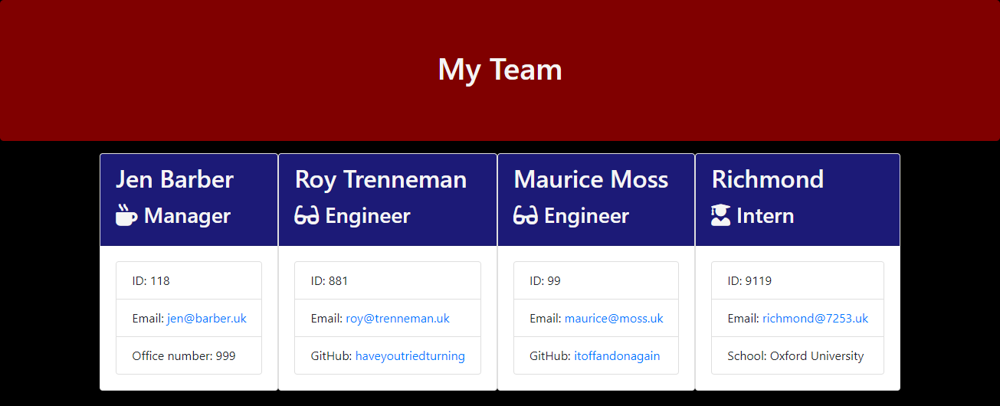

# Team Profile Generator

## Description

This application, using terminal commands, generates team member profiles into an html document based on each member's respective role. When prompted in the command line, the user will input the name, id, email, and role of the employee. There are three roles: Manager, engineer, and intern. They will then be asked a roll-specific question, and if they would like to add another employee. If they input `y`, they can keep adding employees indefinitely. If they input `n` the application will render an html file with all the employee information the user provided.

## Usage

To use run `node app.js` in the terminal and answer the prompts.

Here is a [video demo](https://drive.google.com/file/d/1CsBiHmhd7vxJZBjxQU2P072da91uJTbR/view?usp=sharing) of the application.

## Credits

[Node](https://nodejs.org/en/)

[Inquirer](https://www.npmjs.com/package/inquirer)

## License

[GNU General Public License v3.0](https://choosealicense.com/licenses/gpl-3.0/)